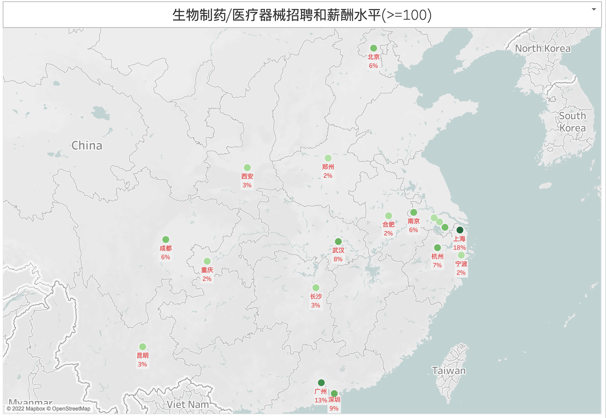
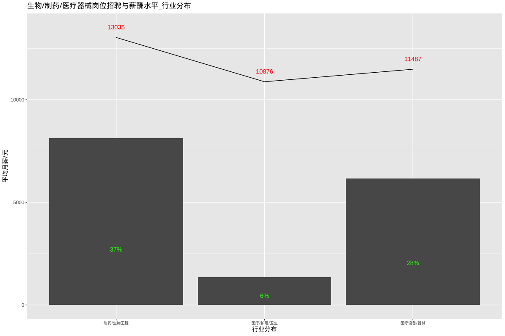
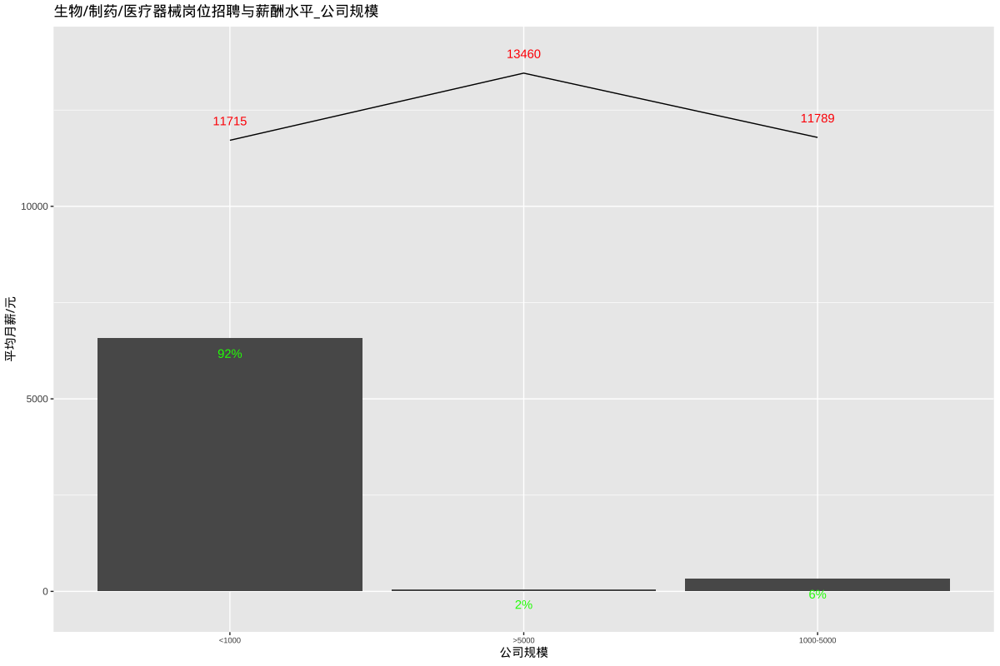
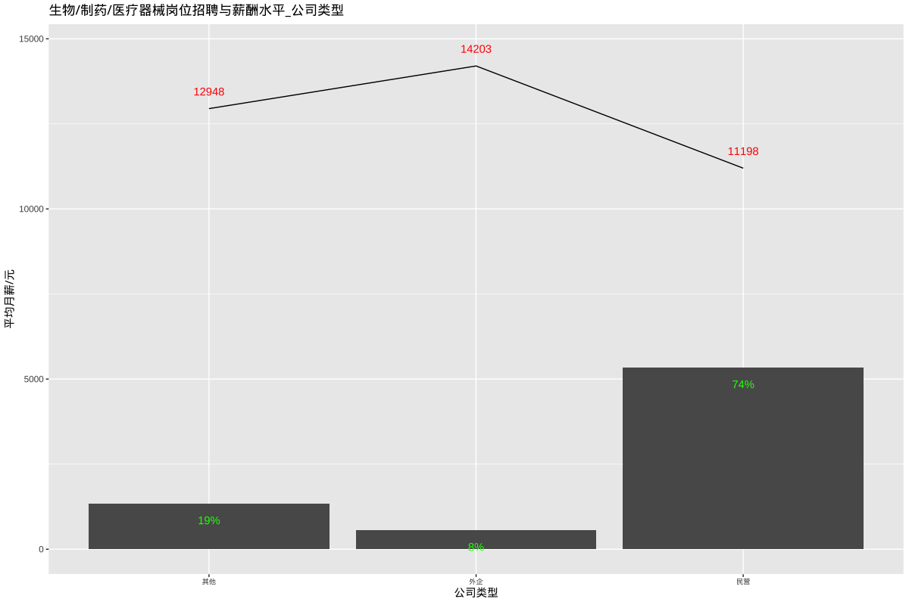
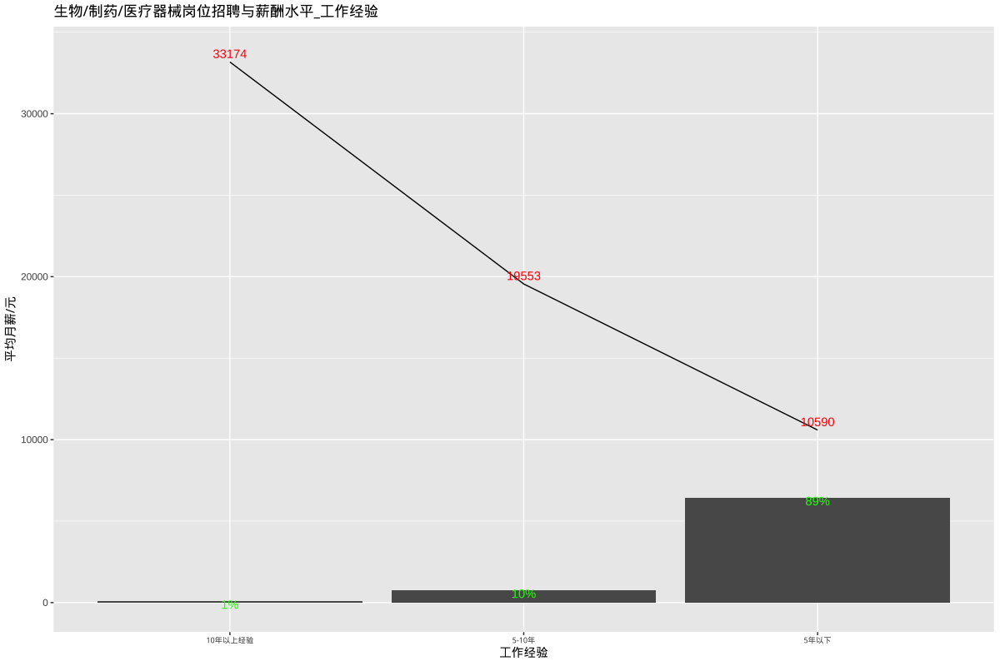
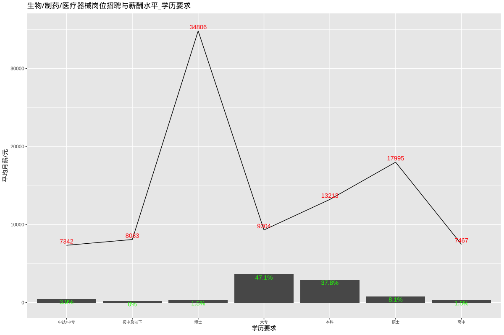

# 生物/制药/医疗器械招聘和薪酬水平

## 总述

本次采集有效数据7258条（城市发布量\>=100），主要分析生物制药/医疗器械相关岗位招聘和薪酬，岗位如医疗器械销售、医药销售代表、注册专员、研发工程师、药物合成研究员、制剂研究、质量经理、产品经理等。我们将从如下分析：

-   01.城市分布：上海占18%，平均月薪15128元；广州占13%,平均月薪11216元；深圳占9%，平均月薪12871元，其余城市均在8%或以下。

-   02.行业分布：制药/生物工程占37%，平均月薪13035元；医疗设备/器械占28%，平均月薪11487元。

-   03.公司规模：1000人以下占92%，平均月薪11715元；1000-5000人占6%，平均月薪11789元。

-   04.公司类型：民企占74%，平均月薪11198元；外企占8%，平均月薪14203元。

-   05.工作经验：5年以下占89%，平均月薪10590元；5-10年占10%，平均月薪19553元。

-   06.学历要求：大专占47%，平均月薪9304元；本科占38%，平均月薪13213元。

## 01.城市分布

## 02.行业分布

## 03.公司规模

## 04.公司类型

## 05.工作经验

## 06.学历要求

